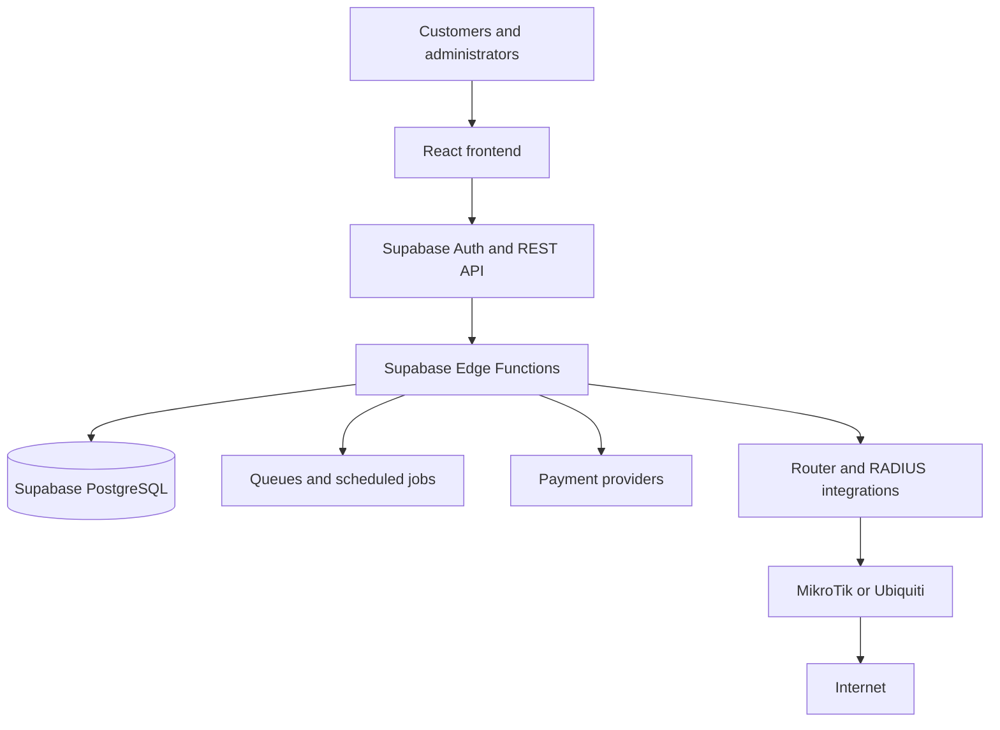

# Wi-Fi Hotspot Billing System

A multi-tenant Wi-Fi hotspot billing platform for hotels, apartments, schools, cyber cafes, restaurants, and internet service providers. The system is designed to help hotspot operators manage customers, sell internet access, control connected sessions, and generate recurring revenue.

> **Project status:** Product specification and development plan. The application implementation has not yet been added to this repository.

## Product Goals

- Give customers a simple way to authenticate and purchase internet access.
- Give operators centralized control over packages, vouchers, users, routers, and active sessions.
- Support recurring subscription revenue through a cloud-based, multi-tenant SaaS model.
- Provide a foundation for Kenyan payment and network integrations, including Safaricom M-Pesa and MikroTik.

## Core Features (MVP)

### Customer portal

- Login with a voucher, phone number, or username and password
- Redeem vouchers
- Purchase internet packages
- Pay through M-Pesa
- View internet usage
- View remaining time and data balance

### Admin dashboard

- Create and manage internet packages
- Generate vouchers
- Manage customers and administrators
- View and disconnect active sessions
- View sales and revenue reports
- Manage routers

### Billing

- Time-based packages, such as 1 hour, 24 hours, and 7 days
- Data-based packages, such as 1 GB, 5 GB, and unlimited
- Hybrid packages, such as 5 GB or 24 hours
- Automatic package expiry
- Auto-renewing subscriptions

### Network management

- MikroTik integration
- Ubiquiti integration
- RADIUS authentication
- Bandwidth control
- Session monitoring

### Payment methods

- M-Pesa STK Push
- M-Pesa Paybill
- Airtel Money
- Optional credit and debit card payments

## Technology Stack

The recommended production stack is:

| Layer | Technology |
| --- | --- |
| Backend and API | Supabase (hosted PostgreSQL, Auth, REST API, Realtime, and Edge Functions) |
| Frontend | React, TypeScript, and Tailwind CSS |
| Database | Supabase PostgreSQL |
| Cache and queues | Redis |
| Network integrations | MikroTik API, Ubiquiti, and RADIUS |
| Payments | Safaricom Daraja API, Airtel Money, and optional card gateway |
| Deployment | Docker, GitHub, and CI/CD |
| Future mobile app | React Native or Flutter |

The current frontend uses Supabase directly as its hosted database and API. Use Supabase Edge Functions for trusted server-side work such as payment callbacks, Daraja credentials, router integrations, and scheduled jobs. Never expose a Supabase service-role key in the browser.

### Supabase setup

1. Create a Supabase project.
2. Copy `.env.example` to `.env.local` and set `VITE_SUPABASE_URL` and `VITE_SUPABASE_ANON_KEY`.
3. Run [`supabase/schema.sql`](supabase/schema.sql) in the Supabase SQL editor.
4. Enable Supabase Auth and create operator users before using the protected dashboard data.

Without environment variables, the UI uses its included demo session data so the dashboard can still be previewed locally.

### MikroTik bridge

The [`mikrotik-bridge`](mikrotik-bridge) service connects the billing database to
MikroTik RouterOS so the router enforces what the operators sell:

- Packages become hotspot user profiles (rate limit, shared users, idle timeout).
- Vouchers become hotspot users with `limit-uptime`/`limit-bytes-total` derived
  from their package, so each code expires independently.
- Captive portal self-service payments: `POST /pay` triggers an M-Pesa STK Push
  via Safaricom Daraja; when the customer pays, the bridge records the
  transaction, mints an access voucher, and provisions it on the router —
  the guest is online without operator involvement.
- The dashboard can query live sessions, kick users, ping/reboot routers, and
  block customers through a small authenticated HTTP API.

Setup: run `supabase/schema.sql` (adds provisioning columns), then configure
`mikrotik-bridge/.env` from its `.env.example` and start it with `npm start`.
See [`mikrotik-bridge/README.md`](mikrotik-bridge/README.md) for details.

## System Architecture

The platform should be built as a multi-tenant SaaS. Each business receives an isolated account and manages its own hotspot network, customers, packages, payments, and routers.

## Database Tables

The initial data model is expected to include:

- `users`
- `packages`
- `vouchers`
- `transactions`
- `sessions`
- `routers`
- `payments`
- `administrators`
- `audit_logs`

Tenant ownership should be represented consistently across tenant-specific records. Payment callbacks, session changes, voucher redemption, and administrator actions should be auditable.

## Security Requirements

- HTTPS for all production traffic
- JWT authentication for API access
- Role-based access control (RBAC)
- Two-factor authentication (2FA)
- Secure password hashing
- API rate limiting
- Audit logs for sensitive operations
- Secure validation and idempotent handling of payment callbacks

## Revenue Model

### Monthly subscriptions

- Small business: KSh 2,000 per month
- Medium business: KSh 5,000 per month
- ISP: KSh 15,000+ per month

### One-time license

- KSh 20,000-100,000 per installation

### Cloud pricing

Cloud pricing can be calculated monthly using:

- Number of hotspots
- Number of active users
- Storage requirements
- Support plan

## Development Roadmap

### Phase 1: 2-3 weeks

- Authentication
- Admin dashboard
- Package management
- Voucher generation

### Phase 2: 2 weeks

- MikroTik API integration
- Customer login
- Internet access control

### Phase 3: 2 weeks

- M-Pesa integration
- Payment processing
- Reports

### Phase 4: 2 weeks

- Analytics
- Notifications
- System optimization

## Version 2 Features

- QR code login
- Google and Facebook login
- SMS OTP
- Email receipts
- Customer analytics
- AI-assisted bandwidth optimization
- Multi-branch and franchise management
- Dark mode
- WhatsApp notifications
- Mobile application
- Automatic backups

## Future Production Considerations

- Containerized deployments with Docker
- Automated testing and CI/CD through GitHub
- Tenant-aware observability and operational alerts
- Background jobs for payment reconciliation, expiry, notifications, and reporting
- Database backups and a tested restore procedure
- A professional, responsive UI/UX for both customer and administrator workflows

## Contributing

Contribution guidelines will be added when the application source code and development workflow are established.

## License

No license has been selected yet.